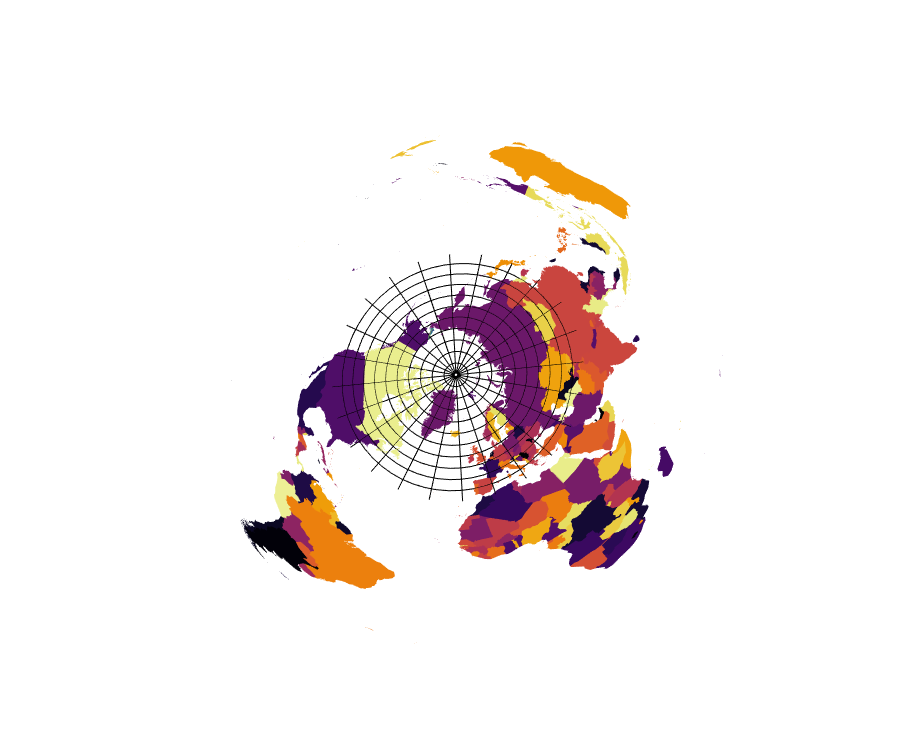
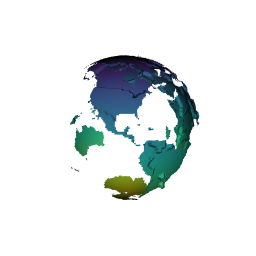

  
  ```{r, echo = FALSE}
knitr::opts_chunk$set(
collapse = TRUE,
comment = "#>",
fig.path = "vignettes/readme-figure/README-"
)
rgl::par3d(windowRect = c(100, 100, 512 + 100, 512 +100))
library(raster)
library(maptools)
```


Get some maps and plot in 3D - in plane view, or globe view. 

**NOTE:** some of these examples here just show snapshots. It's much more interesting to run these yourself locally and interact with the rgl plots. 


```{r,eval=TRUE}

library(rgl)
library(maptools)
data(wrld_simpl)
library(raster)

## convert to triangles and plot 
library(rangl)
cmesh <- rangl(wrld_simpl)
plot(cmesh)
```

```{r,echo=FALSE}
subid <- currentSubscene3d()
rglwidget(elementId="wrld_simpl")
rgl.close()
```


```{r}
sids <- raster::shapefile(system.file("shapes/sids.shp", package="maptools"))
projection(sids) <- "+proj=longlat +ellps=clrk66"

ex <- extent(sids) + 5
gl <- graticule::graticule(seq(xmin(ex), xmax(ex), length = 15), 
                           seq(ymin(ex), ymax(ex), length = 8))


## convert to triangles, but wrap onto globe then plot
smesh <- rangl(sids)
plot(globe(smesh))
mgl <- rangl(gl)
mgl$o$color_ <- "black"
plot(globe(mgl), lwd = 2)
```

```{r,echo=FALSE}
subid <- currentSubscene3d()
rglwidget(elementId="sids")
rgl.close()
```

## Holes are (trivially) supported. 

It's trivial to have "holes", because there are no holes, because we have a true surface, composed of 2D primitives (triangles). 

```{r,eval=TRUE}
library(spbabel)
data(holey)

## SpatialPolygonsDataFrame
sph <- sp(holey)

glh <- rangl(sph)
plot(glh)
```

```{r,echo=FALSE}
subid <- currentSubscene3d()
rglwidget(elementId="hole-sweet-hole")
rgl.close()
```


## Lines are supported. 


```{r,eval=TRUE}
linehouse <- as(sph, "SpatialLinesDataFrame")
plot(rangl(linehouse))
```

```{r,echo=FALSE}
subid <- currentSubscene3d()
rglwidget(elementId="line-house")
rgl.close()
```


## Globe lines

```{r,eval=TRUE}
lmesh <- rangl(as(wrld_simpl, "SpatialLinesDataFrame"))
plot(globe(lmesh))
```

```{r,echo=FALSE}
subid <- currentSubscene3d()
rglwidget(elementId="globe-lines")
rgl.close()
```


## Mesh3d rgl

Rgl mesh3d objects that use "triangle" primitives are supported. 

```{r,eval=TRUE}
library(rgl)

dod <- rangl(dodecahedron3d(col = "cyan"))
octo <- rangl(translate3d(octahedron3d(col = "blue"), 6, 0, 0))
plot(dod, col = viridis::viridis(5)[1], alpha = 0.3)
plot(octo, col = viridis::viridis(5)[5], alpha = 0.3)
bg3d("grey")
```

```{r,echo=FALSE}
subid <- currentSubscene3d()
rglwidget(elementId="model-3d")
rgl.close()
```


To complete the support for these rgl objects we need quads, and to allows a mix of quads and triangles in one data set (that's what `extrude3d` uses). Extrusion is a bit limiting so it's unclear how useful this is (yes it is common, though). See `rgl::extrude3d` for the most readily available method in R. 


## Points


And points work!  (Don't laugh). 


```{r}
library(rangl)
library(maptools)
data(wrld_simpl)
mpts <- as(as(wrld_simpl, "SpatialLinesDataFrame"), "SpatialMultiPointsDataFrame")
plot(rangl(mpts))
rgl::view3d(theta = 25, phi = 3)
```

```{r,echo=FALSE}
subid <- currentSubscene3d()
rglwidget(elementId="points-work")
rgl.close()
```


## Trips

The trip package includes  a 'walrus818' data set courtesy of Anthony Fischbach.  Zoom around and see if you can find them. 

```{r,eval=FALSE}
library(trip)
library(rangl)
data(walrus818)

library(graticule)
prj <-"+proj=laea +lon_0=0 +lat_0=90 +ellps=WGS84"
gr <- graticule(lats = seq(40, 85, by = 5), ylim = c(35, 89.5), proj = prj)
library(maptools)
data(wrld_simpl)

w <- spTransform(subset(wrld_simpl, coordinates(wrld_simpl)[,2] > -70),  prj)
library(graticule)
walrus <- spTransform(walrus818, prj)

gr$color_ <- "black"
rgl::par3d(windowRect = c(100, 100, 912 + 100, 912 +100))
plot(rangl(gr))
w$color_ <- sample(viridis::inferno(nrow(w)))
plot(rangl(w), specular = "black")
plot(rangl(walrus))
um <- structure(c(0.934230506420135, 0.343760699033737, 0.0950899347662926, 
                  0, -0.302941381931305, 0.905495941638947, -0.297159105539322, 
                  0, -0.188255190849304, 0.24880850315094, 0.950081348419189, 0, 
                  0, 0, 0, 1), .Dim = c(4L, 4L))
par3d(userMatrix = um)
rgl::rgl.snapshot("vignettes/readme-figure/README-walrus.png"); rgl.close()

```




## Rasters

Single layer rasters are supported. 

```{r, eval=FALSE}
wrld <- rasterize(wrld_simpl, raster())
plot(rangl(wrld/10))
rgl::rgl.snapshot("vignettes/readme-figure/README-raster.png"); rgl.close()

plot(globe(rangl(wrld*100000)), specular = "black")
rgl::rgl.snapshot("vignettes/readme-figure/README-rasterglobe.png");
rgl.close()

```




```{r, eval=FALSE}
library(marmap) ## has topo data
data(hawaii)
hraster <- setExtent(flip(t(raster(unclass(hawaii))), "y"),  extent(unlist(lapply(attr(hawaii, "dimnames"), function(x) as.numeric(c(head(x, 1), tail(x, 1)))))))

projection(hraster) <- "+proj=longlat +ellps=WGS84"
## use radius rather than vertical exaggeration in geocentric view
harangued <- rangl(hraster)

plot(globe(harangued, gproj = "+proj=geocent +a=12756"), col = "grey")
plot(globe(rangl(setValues(hraster, 0)), "+proj=geocent +a=12756"), col = "blue", alpha = 0.3)
bg3d("darkgrey")
um <- structure(c(0.482606261968613, -0.547331035137177, -0.683754205703735, 
0, -0.861825466156006, -0.435853540897369, -0.259400486946106, 
0, -0.156038910150528, 0.714465141296387, -0.682049512863159, 
0, 0, 0, 0, 1), .Dim = c(4L, 4L))
par3d(userMatrix = um)

rgl::rgl.snapshot("vignettes/readme-figure/README-example-hawaii.png"); rgl.close()

```


## Spatially explicit ecosystem model (Atlantis)

Still a work in progress, but this is what an Atlantis model "really" looks like. 

```{r, eval=FALSE}
## Spatially explicit ecosystem model (Atlantis)


library(rbgm)
bgm <- bgmfile(bgmfiles::bgmfiles("antarctica_99"))

bgm$boxes$botz
cols <- viridis::viridis(nrow(bgm$boxes))
for (i in seq(nrow(bgm$boxes))) {
  #x <- sp::spTransform(boxSpatial(bgm)[i, ], "+proj=laea +lat_0=-65 +lon_0=100")
  x <- boxSpatial(bgm)[i, ]
  dz <- rbgm:::build_dz(x$botz)
  #z0 <- 0
  alp <- seq(0.05, 0.9, length = length(dz))
  for (zi in seq_along(dz)) {
    if (dz[zi] > 0) {
      p <- spbabel::sptable(x)[, c("x_", "y_")]
      rglobj <- rgl::extrude3d(p, thickness = dz[zi])
      rglobj$vb[3,] <- rglobj$vb[3,] - sum(dz[seq(zi)])
      # print(sum(dz[seq(zi)]))
      rgl::shade3d(rglobj, col = cols[i], alpha = alp[zi], 
                   specular = "black")
    }
  }
}
rgl::aspect3d(1, 1, 1.2)
```


