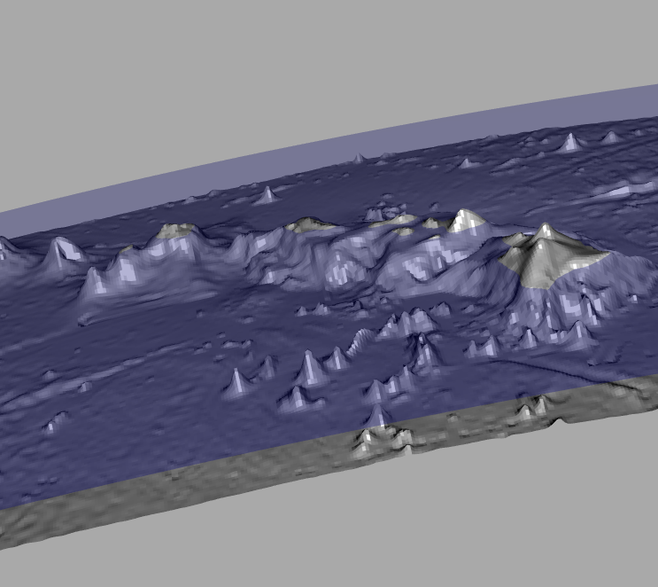

```{r setup, include=FALSE}
knitr::opts_chunk$set(echo = TRUE)
```


## Rasters

Single layer rasters are supported. 

```{r, eval=FALSE}
wrld <- rasterize(simpleworld, raster())
plot(rangl(wrld/10))
rgl::rgl.snapshot("vignettes/readme-figure/README-raster.png"); rgl.close()

plot(globe(rangl(wrld*100000)), specular = "black")
rgl::rgl.snapshot("vignettes/readme-figure/README-rasterglobe.png");
rgl.close()

```


```{r, eval=FALSE}
library(marmap) ## has topo data
data(hawaii)
hraster <- setExtent(flip(t(raster(unclass(hawaii))), "y"),  extent(unlist(lapply(attr(hawaii, "dimnames"), function(x) as.numeric(c(head(x, 1), tail(x, 1)))))))

projection(hraster) <- "+proj=longlat +ellps=WGS84"
## use radius rather than vertical exaggeration in geocentric view
harangued <- rangl(hraster)

plot(globe(harangued, gproj = "+proj=geocent +a=12756"), col = "grey")
plot(globe(rangl(setValues(hraster, 0)), "+proj=geocent +a=12756"), col = "blue", alpha = 0.3)
bg3d("darkgrey")
um <- structure(c(0.482606261968613, -0.547331035137177, -0.683754205703735, 
0, -0.861825466156006, -0.435853540897369, -0.259400486946106, 
0, -0.156038910150528, 0.714465141296387, -0.682049512863159, 
0, 0, 0, 0, 1), .Dim = c(4L, 4L))
par3d(userMatrix = um)

rgl::rgl.snapshot("vignettes/readme-figure/README-example-hawaii.png"); rgl.close()

```



